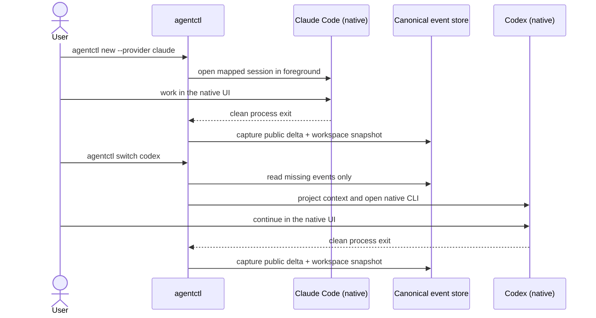

# agentctl

**Move one coding session between the native Claude Code and Codex CLIs.**

[](https://github.com/leofmarciano/agentctl/actions/workflows/ci.yml)
[](https://github.com/leofmarciano/agentctl/releases/latest)
[](Cargo.toml)
[](LICENSE)

`agentctl` is a local session bridge, not another chat client. It opens the
real `claude` or `codex` interactive terminal in the foreground. You keep the
provider's native UI, login, tools, MCP servers, hooks, permissions, slash
commands, and agent loop. When you exit, `agentctl` captures the completed
public delta; when you switch, it projects that delta into the other provider.

```text
Claude Code (native)  -- exit + capture -->  canonical session
canonical session    -- project + open -->  Codex (native)
Codex (native)        -- exit + capture -->  canonical session
canonical session    -- project + open -->  Claude Code (same native session)
```

> **Pre-1.0:** provider protocols change. Run `agentctl doctor` after updating
> Claude Code or Codex. `agentctl` fails closed when it cannot prove that a
> handoff is safe.

[Quick start](#quick-start) · [Realistic walkthrough](#a-normal-claude--codex--claude-session) · [Installation](#installation) · [Commands](#command-reference) · [How it works](#how-it-works) · [Limits](#compatibility-and-limits)

## Why agentctl exists

Claude Code and Codex each maintain their own native session history. A useful
coding task, however, also lives in the worktree: files changed, commands run,
tests passed, decisions made, and work still open. Starting the other CLI by
hand loses the reliable link between those pieces.

`agentctl` adds that link while leaving execution with the native clients:

| `agentctl` owns | Claude Code / Codex still own |
| --- | --- |
| Canonical session and audit log | Interactive terminal UI |
| Native session-ID mapping | Authentication and credentials |
| Context projection at switch boundaries | Model calls and streaming |
| Workspace identity and one-writer lock | Tools, MCPs, hooks, and agent loop |
| Provider health, sync lag, and recovery state | Native permission and sandbox prompts |

There is no `agentctl` prompt box or replacement REPL. You type every
conversation prompt inside Claude Code or Codex.

## Quick start

For the complete bridge, install and authenticate both native CLIs first. Then:

```bash
agentctl doctor

cd ~/code/checkout-api
agentctl new --name checkout-race --provider claude
```

Claude Code now owns the terminal. Work normally, finish the current native
turn, and exit Claude Code. To continue in Codex:

```bash
agentctl switch codex --session checkout-race
```

After the Codex turn finishes, exit Codex and return to the mapped Claude
session:

```bash
agentctl switch claude --session checkout-race
```

That process boundary is intentional. `agentctl` never hot-swaps an agent
under a running native CLI and never types or replays a prompt for you.

## A normal Claude → Codex → Claude session

The following is the intended day-to-day workflow. Lines marked **illustrative
prompt** are examples typed by the user inside the provider UI; their responses
depend on the repository, model, and installed provider version.

### 1. Start in native Claude Code

```console
$ cd ~/code/checkout-api
$ agentctl new --name checkout-race --provider claude

# The native Claude Code interface opens in this terminal.
# Illustrative prompt typed inside Claude Code:
> Find the checkout race, implement the safest fix, and run focused tests.
```

Review Claude's native tool and permission prompts as usual. When the turn is
complete, exit the provider cleanly:

```text
/exit
```

On process exit, `agentctl` captures the public provider delta and the
before/after Git state, then releases the worktree lock.

### 2. Hand the same task to native Codex

```console
$ agentctl switch codex --session checkout-race

# The native Codex interface opens in the same worktree.
# Illustrative prompt typed inside Codex:
> Review the race fix already in the worktree. Resolve anything unsafe and run the full tests.
```

Before opening Codex, `agentctl` synchronizes only the missing canonical
events. Codex sees the prior public request/result plus the current files and
Git diff. It is not called in the background while Claude is active.

Finish the native Codex turn and exit:

```text
/exit
```

### 3. Return to the same native Claude session

```console
$ agentctl switch claude --session checkout-race

# The original mapped Claude session resumes.
# Illustrative prompt typed inside Claude Code:
> Codex reviewed the change. Give me the final state, remaining risks, and validation results.
```

Claude receives the Codex handoff as structured historical context on that
first real user prompt. This timing matters: simply opening and exiting Claude
does not consume a pending handoff.

### What was actually validated

The repository includes an opt-in PTY smoke test for precisely this native
boundary. It opens Claude, verifies that a second writer is blocked, exits,
opens Codex, exits, returns to the same Claude session UUID, and runs sync
twice to verify idempotency. It submits no model prompt.

For the v0.1.0 launch, this walkthrough was revalidated on 2026-07-12 using
Claude Code `2.1.207`, Codex CLI `0.144.0`, and `agentctl 0.1.0`. Volatile IDs
and the disposable path are normalized below:

```console
$ scripts/native-e2e-smoke.sh
==> creating disposable Git worktree and canonical session
==> opening native claude-first UI
==> verifying the per-worktree writer lock
==> opening native codex UI
==> opening native claude-return UI
==> running projection synchronization twice
==> native bridge smoke passed
session: <generated-uuid>
workspace: <temporary-worktree>
latest canonical seq: 6
model prompts submitted: 0
```

The final status was also checked. This is an abridged rendering of the real
pretty-JSON output:

```json
{
  "session": {
    "active_provider": { "kind": "claude" },
    "status": "idle"
  },
  "latest_seq": 6,
  "providers": [
    {
      "session": {
        "provider": { "kind": "claude" },
        "last_synced_seq": 2,
        "status": "ready"
      },
      "sync_lag": 4
    },
    {
      "session": {
        "provider": { "kind": "codex" },
        "last_synced_seq": 6,
        "status": "ready"
      },
      "sync_lag": 0
    }
  ]
}
```

Claude's lag is expected in this no-prompt test: the Codex → Claude delta is
delivered by Claude's next `UserPromptSubmit` hook, not by pretending that a
mere process launch was a durable receipt.

## How it works



Each unified session maps to one native session per provider:

```text
agentctl session: checkout-race
├── Claude session: <uuid>
└── Codex thread:   <thread-id>
```

The canonical append-only event log is the source of truth. Provider histories
are projections, and the worktree is shared physical memory. Projection
receipts are idempotent, synchronization is lazy, and only one native writer
may own a worktree at a time.

### What is transferred

The bounded handoff can include:

- user requests and final assistant results;
- public plans, decisions, errors, and open work;
- command and tool outcomes relevant to the task;
- changed paths, summarized Git state, and test results;
- usage or rate-limit signals exposed by the provider;
- hashes for omitted large content and projection receipts.

It deliberately excludes private reasoning, credentials, giant logs, duplicate
provider output, and complete files that the next agent can read from disk.
Large retained diagnostics use content-addressed compressed blobs.

### Why the provider histories are asymmetric

Codex exposes official `thread/read` and `thread/inject_items` APIs. A Claude →
Codex handoff can therefore become native user/assistant transcript messages
without starting another model turn.

Claude Code does not expose a public equivalent for inserting an arbitrary
external assistant message. A Codex → Claude handoff is delivered as structured
historical context by the next real `UserPromptSubmit` hook. Claude gets
semantic continuity, but its provider-owned transcript is not a byte-for-byte
copy of the Codex transcript.

`agentctl` never edits either provider's private transcript JSONL.

## Command reference

Management commands currently render pretty JSON, making session IDs, native
mappings, sync cursors, and recovery state explicit.

### Open and move sessions

| Command | Purpose |
| --- | --- |
| `agentctl` | Open the active provider for the current workspace session. |
| `agentctl new --name NAME --provider claude\|codex` | Create a canonical session and open the selected native CLI. |
| `agentctl new --name NAME --no-launch` | Prepare a session without opening a provider. |
| `agentctl open [claude\|codex] --session SESSION` | Open one mapped provider without changing the canonical session. |
| `agentctl switch claude\|codex --session SESSION` | Sync the delta, change the active provider, and open its native CLI. |
| `agentctl resume SESSION` | Reopen the session's active native provider. |
| `agentctl provider auto\|claude\|codex --session SESSION` | Change automatic or manual provider selection. |

### Inspect and maintain state

| Command | Purpose |
| --- | --- |
| `agentctl list` | List canonical sessions. |
| `agentctl status [SESSION]` | Show provider mappings, health, sync lag, and worktree state. |
| `agentctl history [SESSION] [--limit N]` | Inspect the canonical public history. |
| `agentctl metrics [SESSION]` | Inspect local provider, usage, and synchronization aggregates. |
| `agentctl sync [SESSION]` | Project a pending delta without opening a chat. |
| `agentctl compact SESSION` | Build a deterministic bounded context checkpoint. |
| `agentctl fork SESSION --name NAME` | Fork canonical history. |
| `agentctl export SESSION FILE --include-blobs --redact` | Create a portable, best-effort-redacted export. |
| `agentctl import FILE` | Import a canonical export. |
| `agentctl repair` | Check and repair local indexes, blobs, permissions, and receipts. |
| `agentctl delete SESSION` | Delete a local canonical session. |

Run `agentctl COMMAND --help` for the exact options supported by the installed
version.

### Passing native options

Arguments after `--` are forwarded only if they are recognized, bounded native
options that do not replace the wrapper-owned session, worktree, hook overlay,
or foreground lifecycle:

```bash
agentctl open claude --session checkout-race -- --model sonnet
agentctl open codex --session checkout-race -- --no-alt-screen
```

Unknown options and positional arguments fail closed. A positional argument
could be interpreted as an initial provider prompt, and `agentctl` never owns
prompt submission. Provider-specific options require an explicit provider;
automatic selection accepts only the intersection of both allowlists.

Native security controls explicitly passed by the user remain the user's
choice. `agentctl` does not add them and rejects each provider's all-in-one
bypass option.

## Bringing existing chats under agentctl

Create an empty canonical session first:

```bash
agentctl new --name imported-work --no-launch
```

### Existing Codex thread

Codex provides an official history API, so its supported public transcript can
be imported into the canonical event log:

```bash
agentctl import-native codex THREAD_ID \
  --session imported-work \
  --activate
agentctl resume imported-work
```

The import uses `thread/read(includeTurns=true)`, excludes private reasoning
and bulky outputs, and is idempotent by stable native item identity. It fails
closed for partial or unsupported history shapes.

To continue an existing thread without importing its old public history:

```bash
agentctl attach codex THREAD_ID --session imported-work --activate
```

### Existing Claude Code session

Claude Code does not expose a supported full transcript-read API. `agentctl`
can validate and resume an existing session UUID, but cannot retroactively
import its old transcript:

```bash
agentctl attach claude SESSION_UUID --session imported-work --activate
agentctl resume imported-work
```

New turns made through the wrapper are captured from that point forward. If
Codex needs the earlier context, produce an explicit public handoff summary in
the attached Claude session; that new turn can be transferred.

## Installation

### Prerequisites

- Claude Code and/or Codex installed and authenticated directly with their own
  native login flow;
- Git available for workspace identity and snapshots;
- a supported 64-bit Linux, macOS, or Windows host.

`agentctl` never reads, copies, refreshes, or stores provider credentials.

### GitHub Releases

Download the archive and adjacent SHA-256 file from the
[latest release](https://github.com/leofmarciano/agentctl/releases/latest):

| Platform | Asset |
| --- | --- |
| Linux x86_64 (musl) | `agentctl-x86_64-unknown-linux-musl.tar.gz` |
| macOS Intel | `agentctl-x86_64-apple-darwin.tar.gz` |
| macOS Apple Silicon | `agentctl-aarch64-apple-darwin.tar.gz` |
| Windows x86_64 | `agentctl-x86_64-pc-windows-msvc.zip` |

Example for Apple Silicon macOS:

```bash
curl -LO https://github.com/leofmarciano/agentctl/releases/latest/download/agentctl-aarch64-apple-darwin.tar.gz
curl -LO https://github.com/leofmarciano/agentctl/releases/latest/download/agentctl-aarch64-apple-darwin.tar.gz.sha256
shasum -a 256 -c agentctl-aarch64-apple-darwin.tar.gz.sha256
tar -xzf agentctl-aarch64-apple-darwin.tar.gz
mkdir -p "$HOME/.local/bin"
install -m 0755 agentctl-aarch64-apple-darwin/agentctl "$HOME/.local/bin/agentctl"
export PATH="$HOME/.local/bin:$PATH"
```

Persist the PATH line in your shell profile if `~/.local/bin` is not already on
PATH. On Linux, use the `x86_64-unknown-linux-musl` asset and `sha256sum -c`
instead of `shasum -a 256 -c`; the remaining commands are identical. The musl
target avoids depending on the build runner's glibc version.

On Windows PowerShell, verify and expand the ZIP, then place `agentctl.exe` in a
directory on PATH:

```powershell
$asset = "agentctl-x86_64-pc-windows-msvc"
Invoke-WebRequest "https://github.com/leofmarciano/agentctl/releases/latest/download/$asset.zip" -OutFile "$asset.zip"
Invoke-WebRequest "https://github.com/leofmarciano/agentctl/releases/latest/download/$asset.zip.sha256" -OutFile "$asset.zip.sha256"
$expected = (Get-Content "$asset.zip.sha256").Split()[0]
$actual = (Get-FileHash "$asset.zip" -Algorithm SHA256).Hash.ToLowerInvariant()
if ($actual -ne $expected) { throw "agentctl checksum mismatch" }
Expand-Archive "$asset.zip" -DestinationPath .
New-Item -ItemType Directory -Force "$HOME\bin" | Out-Null
Copy-Item "$asset\agentctl.exe" "$HOME\bin\agentctl.exe"
```

Add `$HOME\bin` to the user PATH if needed. Every release archive also contains
this README and the MIT license.

### Build from source

Use the repository's pinned Rust toolchain. The declared MSRV is 1.88:

```bash
git clone https://github.com/leofmarciano/agentctl.git
cd agentctl
cargo install --locked --path crates/cli
```

Workspace packages are intentionally `publish = false`; crates.io installation
is not supported during pre-1.0 development.

## Configuration and local state

Global configuration lives at `~/.agentctl/config.toml`. A repository may add
a restricted `.agentctl.toml` containing routing fields only. Repository config
cannot replace provider binaries or weaken retention and redaction policy.

```toml
retention_days = 30
redaction_patterns = ["ACME-[0-9]{4}"]

[routing]
policy = "sticky-balanced"
switch_threshold = 0.25
failure_window_seconds = 300
max_recent_failures = 2

[providers]
claude_binary = "claude"
codex_binary = "codex"
```

Routing policies are `manual`, `claude-first`, `codex-first`, `balanced`, and
`sticky-balanced`. Routing chooses which native CLI to open at a process
boundary; it cannot classify a prompt that has not yet been typed.

Use `AGENTCTL_HOME` or `--home PATH` to isolate or relocate state. The state
root contains:

- the SQLite canonical event store in WAL mode;
- content-addressed blobs;
- provider capability evidence and generated Codex schemas;
- workspace locks, launch journals, and diagnostic logs.

On Unix, private directories use mode `0700` and sensitive files use `0600`.
Treat the entire state directory as source material. Configuration schemas are
checked in for [global](schemas/config/agentctl.schema.json) and
[project-local](schemas/config/agentctl-project.schema.json) settings.

## Compatibility and limits

Read these before trusting an important handoff:

- **Exit before switching.** Finish the native turn and leave the provider so
  capture can complete and the worktree lease can be released.
- **Open mapped sessions through `agentctl`.** Running the same Claude/Codex
  session directly or from another terminal is out of band and can make safe
  migration impossible.
- **Do not change native session identity from inside a mapped CLI.** Avoid
  native create, fork, clear, or session-switch commands; exit and use
  `agentctl new`, `fork`, `open`, or `switch`.
- **No transcript surgery.** Provider-private transcript files are never
  edited. Codex and Claude histories are semantically continuous, not
  identical.
- **Claude history before attachment is not importable.** Only new captured
  turns can enter the canonical session automatically.
- **Automatic failover stops at the UI boundary.** When provider selection was
  implicit and no native arguments were forwarded, it may open the remaining
  healthy native CLI after a captured exit or a durable crash continuation.
  It never overrides an explicit provider or submits or replays a user prompt.
- **Side effects are never blindly replayed.** Possible or confirmed effects
  produce a continuation capsule based on current workspace state.
- **Provider telemetry is asymmetric.** Usage and quota fields can be unknown
  when a native protocol does not report them.
- **Pre-1.0 protocols can drift.** Run `agentctl doctor` after every provider
  upgrade. Use `agentctl doctor --live` only when behavioral probing is needed;
  live probes may consume quota.

An interrupted launch can remain `Exited` or `Uncertain`. Confirm its recorded
provider process is dead, inspect the worktree, and use the explicit guarded
recovery only when appropriate:

```bash
agentctl repair \
  --abandon-native-launch LAUNCH_ID \
  --rebuild-projections
```

A launch without a journaled PID remains fail-closed because absence of a PID
does not prove that no provider process survived.

## Security

The canonical database can contain prompts, provider responses, commands, file
paths, and source-related output. Secret-pattern redaction, ANSI
neutralization, JSON size/depth limits, path validation, bounded hook capture,
and content digests are applied before persistence. Raw diagnostic events stay
separate from normalized product events.

The native provider keeps its normal sandbox and permission UI. `agentctl`
does not enable `bypassPermissions`, copy provider tokens, or attempt to hide
usage or bypass quota resets.

For the complete threat and recovery boundary, read [Security and
privacy](docs/security.md) and the project [security policy](SECURITY.md).

## Documentation

- [Documentation index](docs/README.md)
- [Architecture](docs/architecture.md)
- [Native provider protocols](docs/protocols.md)
- [Compatibility policy](docs/compatibility.md)
- [Security and privacy](docs/security.md)
- [Provider plugin authoring](docs/plugin-authoring.md)
- [Release process](docs/releasing.md)
- [Commercial distribution gate](docs/commercial-distribution.md)
- [Architecture decisions](docs/adr/0001-canonical-event-log.md)

## Contributing

Issues and pull requests are welcome. Start with [CONTRIBUTING.md](CONTRIBUTING.md),
keep provider wire formats behind their adapters, and run the full local gates
before opening a PR:

```bash
bash -n scripts/native-e2e-smoke.sh
shellcheck scripts/native-e2e-smoke.sh
cargo fmt --check
cargo clippy --locked --workspace --all-targets --all-features -- -D warnings
cargo test --locked --workspace --all-features
cargo doc --locked --workspace --no-deps
cargo deny check
cargo audit --deny warnings
```

Redacted protocol fixtures are preferred over quota-consuming tests. The
native PTY smoke is intentionally opt-in because it needs installed,
authenticated providers plus `expect`, `jq`, and Git.

## License

Licensed under the [MIT License](LICENSE).
